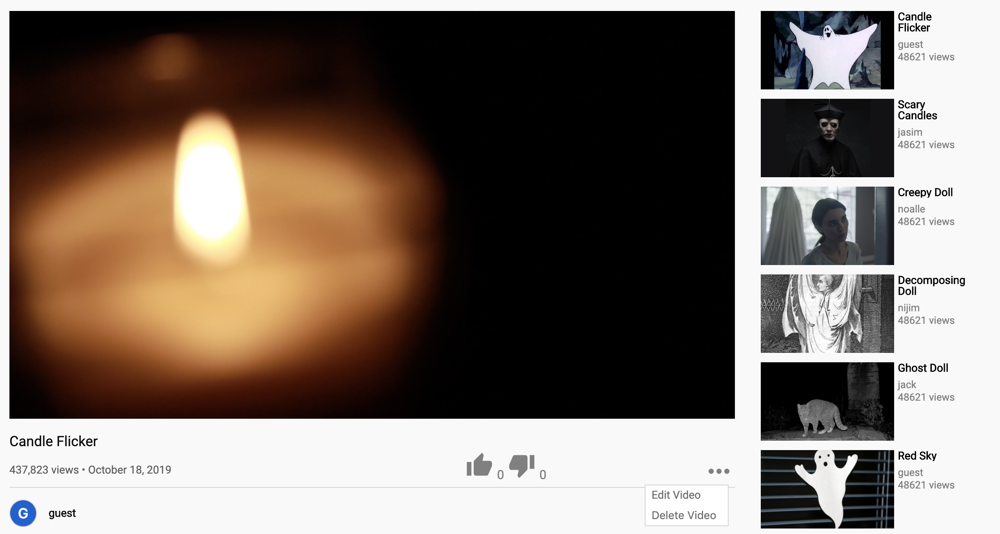

<!-- # README

### todo
* errors are coming back way to long
* not sure how to redirect in the session form
* users are coming back into the state with a weird structure
  * entities:
    * users:
      * undefined:
        * user: {"id":8, "username":"dsfgsg"}
 -->


# TechTube

TechTube is modeled after the popular community driven video streaming service, YouTube. TechTube is a hub of all of the tech related videos around the internet. TechTube allows users to upload their favorite tech videos and share them with the rest of the tech loving community. Users can comment on each others videos and also like them.

### Link: https://tech-tube.herokuapp.com/#/


## Technologies:
  1. PostgreSQL
  2. Ruby on Rails
  3. Jbuilder
  4. JavaScript
  5. React
  6. Redux
  7. CSS
  8. AWS

## Key Features & Implementation
  ### Video
  #### Feature
  Using AWS S3, users can upload and edit videos and video thumbnails on TechTube. Using the add video button at the top of the page from any screen gives users access to the upload video menu.

  

  #### Implementation
  Users ability to access the upload feature is restricted. They must be registered and logged in to upload content. This restriction also applies to the ability to edit a video posted to TechTube. There must be a current user logged into the system, and that current user's id must match the id of the user that owns the video being edited.

  ```javaScript
  let optionMenu;
        let createComment;
        if (video.user.id === this.props.currentUserId) {
          optionMenu = (
            <div className="dropdown">
              <i className="material-icons" onClick={this.handleClick}>more_horiz</i>

              {this.state.show &&
                (<>
                  <div className="modal" onClick={() => this.setState({
                    show: false
                    })}>
                  </div>
                  <div className="option-menu-content">
                    <Link className='edit-video' to={`/videos/${video.id}/edit`}>
                      Edit Video
                    </Link>
                    <button className='delete-video' onClick={this.deleteVideo}>
                      Delete Video
                    </button>
                  </div>
                </>)
              }
            </div>
          )
          
        }
        if (this.props.currentUserId) createComment = <CreateCommentContainer videoId={ video.id } />
  ```

  ### Video Likes
  #### Feature
  Videos can be liked or disliked by a user in the TechTube community. This feature is restricted to authorized users. This feature tracks the number of likes and dislikes that are associated with the video.

  

  #### Implementation
  The liking of videos is a polymorphic association on a video. Each like creates a new entry on the Likes table of a boolean value. Using this boolean value to my advantage with a like represented as a true value and a dislike being represented with a false value. Using the Active Record association made it simple and easy to fetch all of the likes and dislikes for a video as well as the count of likes and dislikes.

  ```Ruby
  case RECEIVE_VIDEO_LIKE:
      like_status = action.response.like ? 'like' : 'dislike';
      return merge({}, oldState, { [action.response.likable_id]: {like_status: like_status}});
  ```

  ```Ruby
  def show
    @video = Video.includes(:likes).find(params[:id])
    if current_user 
      @like = @video.likes.find_by(user_id: current_user.id)
      @like = current_user.likes.find_by(likable_type: 'Video', likable_id: @video.id)
      @num_likes = @video.likes.liked.size
      @num_dislikes = @video.likes.disliked.size
    end
    respond_to do |format|
      format.json
    end
    render :show
  end
  ```

## Future Concepts
  #### Search Feature
  Implement the ability to search for videos by name or description. Also to search for channels.
  #### Liking Comments
  Since the likes are a polymorphic association, it will be easy to tie that association to the comments feature as well. The ability to like a comment is already built out on the backend. The component that is used for liking a video can be inserted into each comment tile. This will give users the ability to like comments.
  #### Replying to Comments
  I could extend the capabilities of the comment component for users to leave a reply on an already existing comment. This would be relatively straight forward to implement since the comment component already exists.
  #### Channel Subscriptions
  Create the ability for users to create channels to upload their content to, and give users the ability to subscribe to those channels. 
